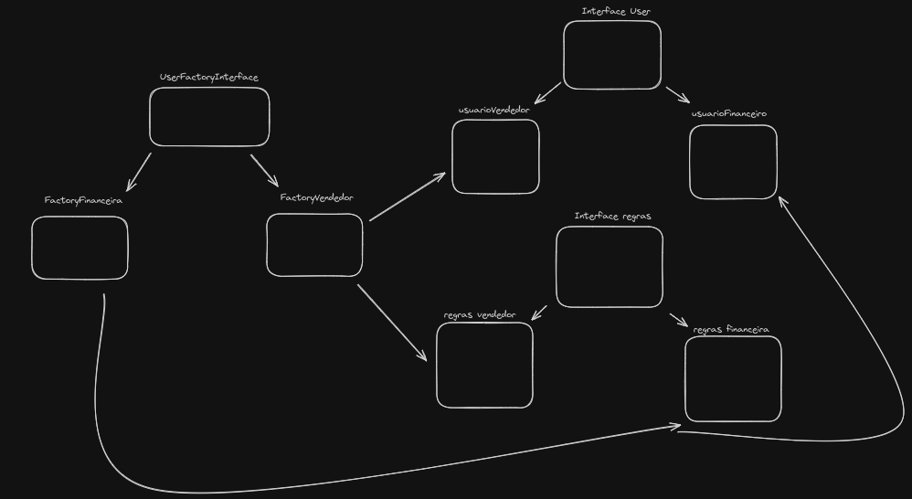
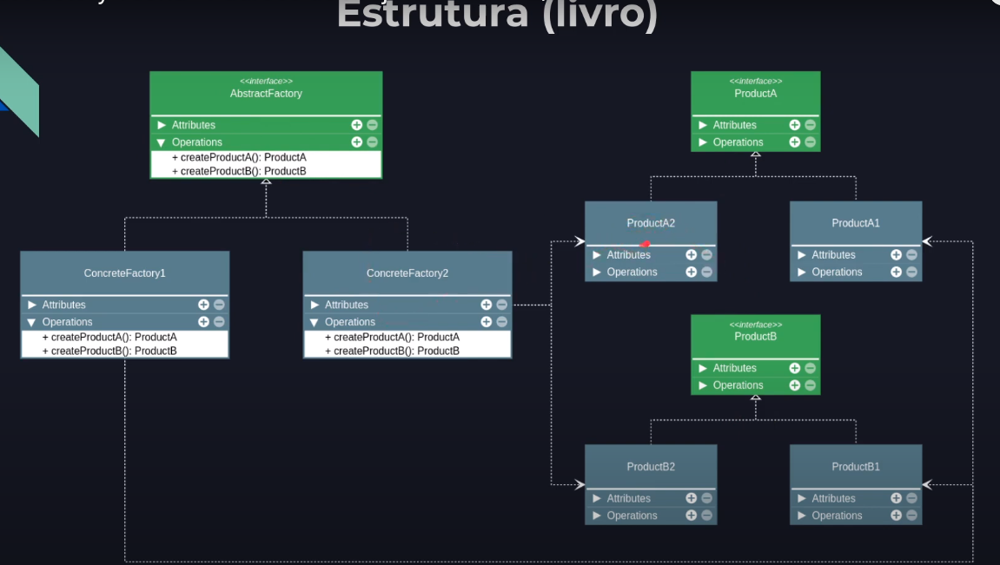

### Ideia

É um padrão de projeto que permite criar familias de objetos relacionados sem especificar a classe concreta.

### Exemplos
  - Em uma aplicação com mais de um tipo de cliente (customer) 
  eu poderia criar uma factory que implementaria uma interface de construção e essa classe (customer) implementaria uma interface de clientes, no fim das contas voltaríamos a estrutura da ilustração abaixo.

### Example of Implementation

### Ilustração
