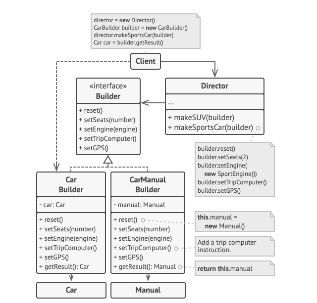

## Builder Pattern.

O builder pattern tem por objetivo quebrar o passos de implementação de um objeto
complexo. Por objeto complexo pense que você deseja criar um carro, existem inumeras
peças que fazem parte do carro, o construtor dessa classe, vou chamar de `Carro`
teria inumeros parâmetros. Utilizando o builder, você poderia quebrar os passos de 
montagem do carro em vários passos (cria motor, cria latarial ...)e ao final 
obter o mesmo resultado.

## Diagrama de classes.

