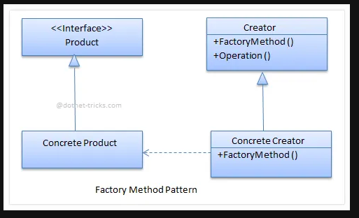

## Ideia
O factory method é um padrão que permite um menor acoplamento do código e portanto uma maior 
flexibilidade. Ele funciona implementando uma interface que é gerada a partir de uma constructor o qual é responsável por criar as classes concretas.

## Exemplo:
    - Uma empresa realiza entregas utilizando apenas um Trucks se em algum dia surgir a 
    necessiadade de mais um tipo de transporte será necessário refatorar toda a base do projeto.

    - Criar um Sistema de documentos, que implementa DOC e PDF e uma vez passado o tipo de documento para o constructor ele criará uma instancia de uma determinada classe. Onde essa classe implementa uma interface em comum.

#### Running
    - usign npm (node package manager) `npm index.ts`